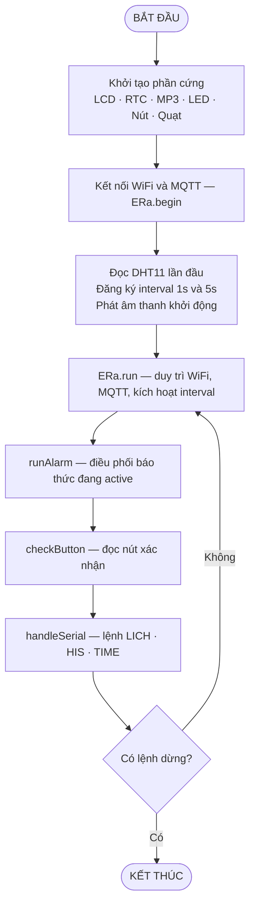
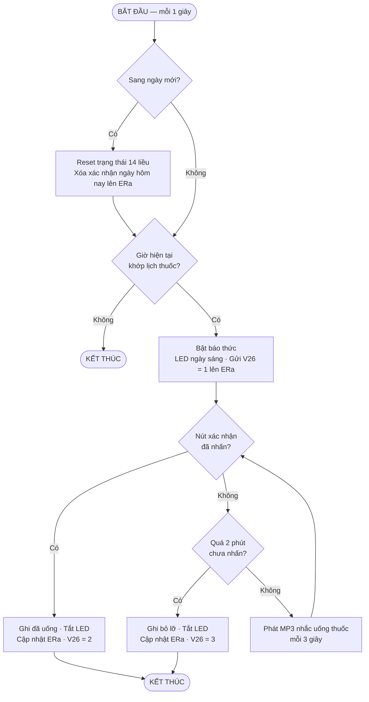

## Hình 1. Giải Thuật Hệ Thống Tổng Quát

### Mô tả nguyên lý hoạt động

Hệ thống bắt đầu bằng `setup()`: khởi tạo phần cứng, kết nối WiFi/MQTT, đọc DHT11 lần đầu, đăng ký hai interval (1 giây và 5 giây), phát âm thanh khởi động. Sau đó chuyển sang `loop()` chạy tuần tự 4 tác vụ: `ERa.run()` duy trì kết nối và kích hoạt interval; `runAlarm()` xử lý báo thức; `checkButton()` đọc nút xác nhận; `handleSerial()` xử lý lệnh debug. Khối điều kiện "Có lệnh dừng?" trên thực tế luôn trả về **Không**, tạo thành vòng quét vô hạn đặc trưng của hệ thống nhúng.

---

## Hình 2. Giải Thuật Kiểm Tra Giờ và Báo Uống Thuốc

### Mô tả nguyên lý hoạt động

Mỗi giây, hệ thống kiểm tra nếu sang ngày mới thì reset toàn bộ 14 trạng thái liều và đồng bộ lên ERa. Tiếp theo so sánh phút hiện tại với từng slot sáng/chiều — nếu **không khớp** thì kết thúc ngay. Khi **khớp**, bật báo thức: LED ngày sáng, gửi V26=1. Hệ thống vào vòng chờ: cứ 3 giây phát MP3 nhắc một lần. Nếu người dùng **nhấn nút** trước 2 phút → ghi đã uống, V26=2, kết thúc. Nếu **quá 2 phút** không nhấn → ghi bỏ lỡ, V26=3, kết thúc.

---

## Hình 3. Giải Thuật Cảm Biến DHT11 và Điều Khiển Quạt

### Mô tả nguyên lý hoạt động

Mỗi 5 giây, `dhtEvent` đọc DHT11. Nếu **đọc thất bại** (NaN) thì bỏ qua chu kỳ, không ghi đè giá trị hợp lệ cuối. Khi thành công, lưu nhiệt độ/độ ẩm, gửi lên ERa (V0, V1) và cập nhật LCD. Tiếp theo `controlFan` kiểm tra **chế độ tay**: nếu đang chế độ tay mà chưa đủ 5 phút thì giữ nguyên và thoát; nếu đã đủ 5 phút thì hủy chế độ tay và đồng bộ V25=2 lên app. Ở **chế độ tự động**: nhiệt độ vượt 32°C hoặc độ ẩm vượt 70% thì **bật quạt**; ngược lại thì **tắt quạt**.

---

