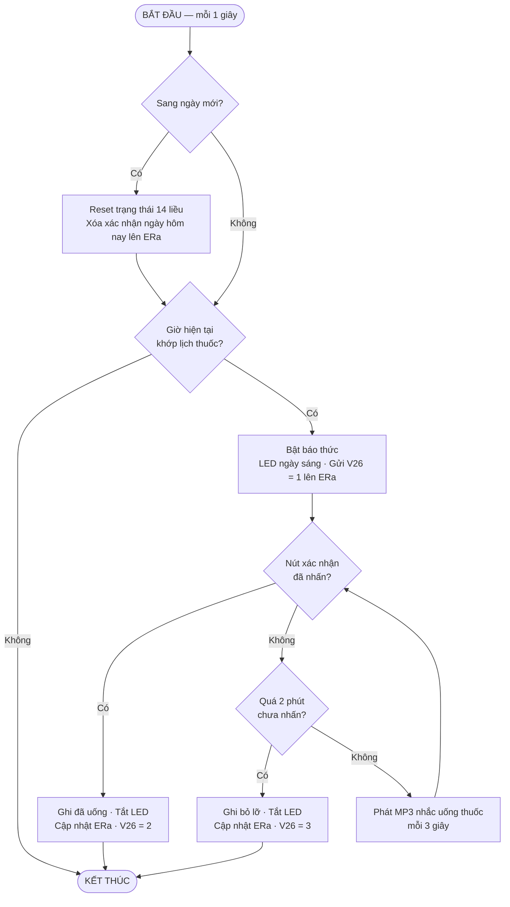
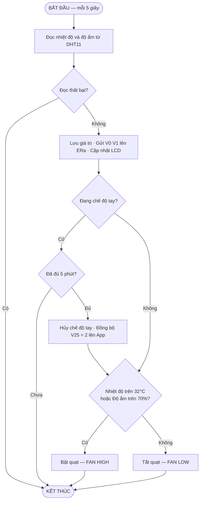
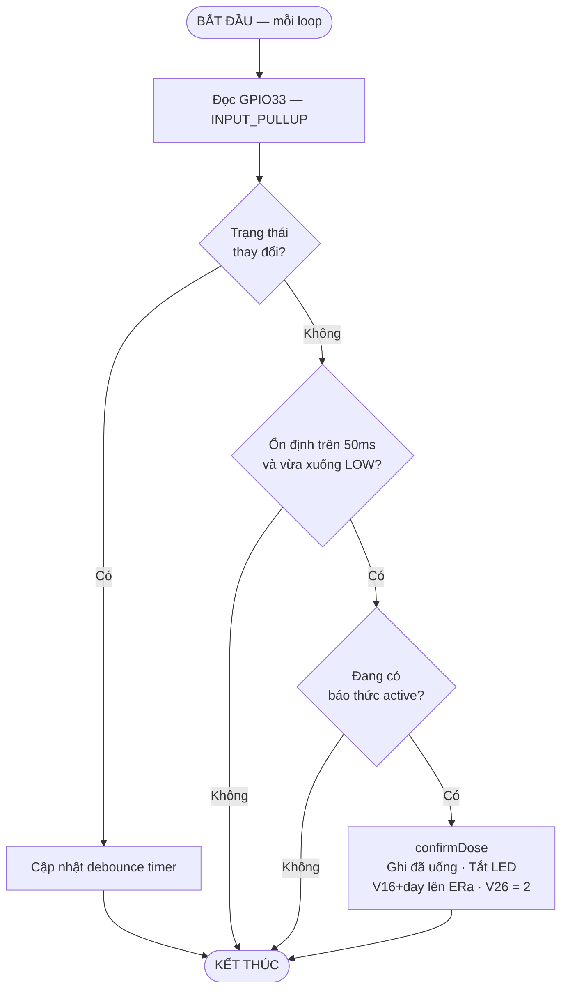
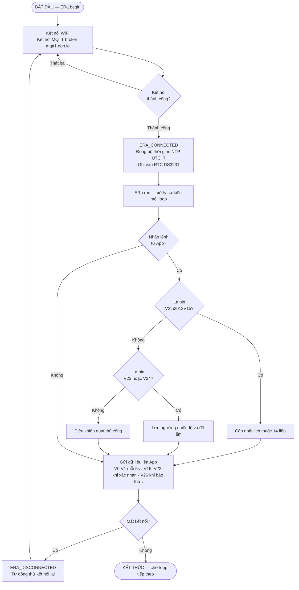

## Hình 1. Giải Thuật Hệ Thống Tổng Quát

### Mô tả nguyên lý hoạt động

Hệ thống bắt đầu bằng `setup()`: khởi tạo phần cứng, kết nối WiFi/MQTT, đọc DHT11 lần đầu, đăng ký hai interval (1 giây và 5 giây), phát âm thanh khởi động. Sau đó chuyển sang `loop()` chạy tuần tự 4 tác vụ: `ERa.run()` duy trì kết nối và kích hoạt interval; `runAlarm()` xử lý báo thức; `checkButton()` đọc nút xác nhận; `handleSerial()` xử lý lệnh debug. Khối điều kiện "Có lệnh dừng?" trên thực tế luôn trả về **Không**, tạo thành vòng quét vô hạn đặc trưng của hệ thống nhúng.

---

## Hình 2. Giải Thuật Kiểm Tra Giờ và Báo Uống Thuốc

### Mô tả nguyên lý hoạt động

Mỗi giây, hệ thống kiểm tra nếu sang ngày mới thì reset toàn bộ 14 trạng thái liều và đồng bộ lên ERa. Tiếp theo so sánh phút hiện tại với từng slot sáng/chiều — nếu **không khớp** thì kết thúc ngay. Khi **khớp**, bật báo thức: LED ngày sáng, gửi V26=1. Hệ thống vào vòng chờ: cứ 3 giây phát MP3 nhắc một lần. Nếu người dùng **nhấn nút** trước 2 phút → ghi đã uống, V26=2, kết thúc. Nếu **quá 2 phút** không nhấn → ghi bỏ lỡ, V26=3, kết thúc.

---

## Hình 3. Giải Thuật Cảm Biến DHT11 và Điều Khiển Quạt

### Mô tả nguyên lý hoạt động

Mỗi 5 giây, `dhtEvent` đọc DHT11. Nếu **đọc thất bại** (NaN) thì bỏ qua chu kỳ, không ghi đè giá trị hợp lệ cuối. Khi thành công, lưu nhiệt độ/độ ẩm, gửi lên ERa (V0, V1) và cập nhật LCD. Tiếp theo `controlFan` kiểm tra **chế độ tay**: nếu đang chế độ tay mà chưa đủ 5 phút thì giữ nguyên và thoát; nếu đã đủ 5 phút thì hủy chế độ tay và đồng bộ V25=2 lên app. Ở **chế độ tự động**: nhiệt độ vượt 32°C hoặc độ ẩm vượt 70% thì **bật quạt**; ngược lại thì **tắt quạt**.

---

## Hình 4. Giải Thuật Đọc Nút Xác Nhận — checkButton

### Mô tả nguyên lý hoạt động

Mỗi vòng `loop()`, `checkButton` đọc GPIO33 (nút active LOW). Nếu trạng thái **vừa thay đổi** thì cập nhật debounce timer và thoát — chưa xử lý vì chưa ổn định. Nếu **không đổi**, kiểm tra đồng thời hai điều kiện: đã ổn định trên 50ms **và** vừa chuyển xuống LOW (tức là cạnh nhấn); nếu không thỏa thì thoát. Khi thỏa, kiểm tra tiếp có đang có **báo thức active** không; nếu có thì gọi `confirmDose()` để ghi đã uống, tắt LED và đồng bộ lên ERa.

---

## Hình 5. Giải Thuật Giao Tiếp ERa IoT

### Mô tả nguyên lý hoạt động

Khi khởi động, ERa kết nối WiFi rồi kết nối MQTT broker. Nếu **thất bại** thì thử lại liên tục cho đến khi thành công. Khi **kết nối thành công**, callback `ERA_CONNECTED` được gọi để đồng bộ thời gian từ máy chủ NTP (UTC+7) vào RTC DS3231 — đảm bảo lịch thuốc luôn chạy đúng giờ thực tế.

Trong mỗi vòng `loop()`, `ERa.run()` kiểm tra hàng đợi sự kiện. Nếu **App gửi lệnh xuống**, hệ thống phân loại theo virtual pin: V2–V15 cập nhật lịch uống thuốc 14 liều; V23/V24 lưu ngưỡng nhiệt độ/độ ẩm; V25 điều khiển quạt tức thì. Dù có hay không có lệnh từ App, hệ thống đều **gửi dữ liệu lên App**: nhiệt độ/độ ẩm mỗi 5 giây (V0, V1), trạng thái xác nhận uống thuốc (V16–V22) và thông báo báo thức (V26) khi có sự kiện. Nếu phát hiện **mất kết nối** thì `ERA_DISCONNECTED` được gọi và vòng lặp quay về bước kết nối lại từ đầu.

---
